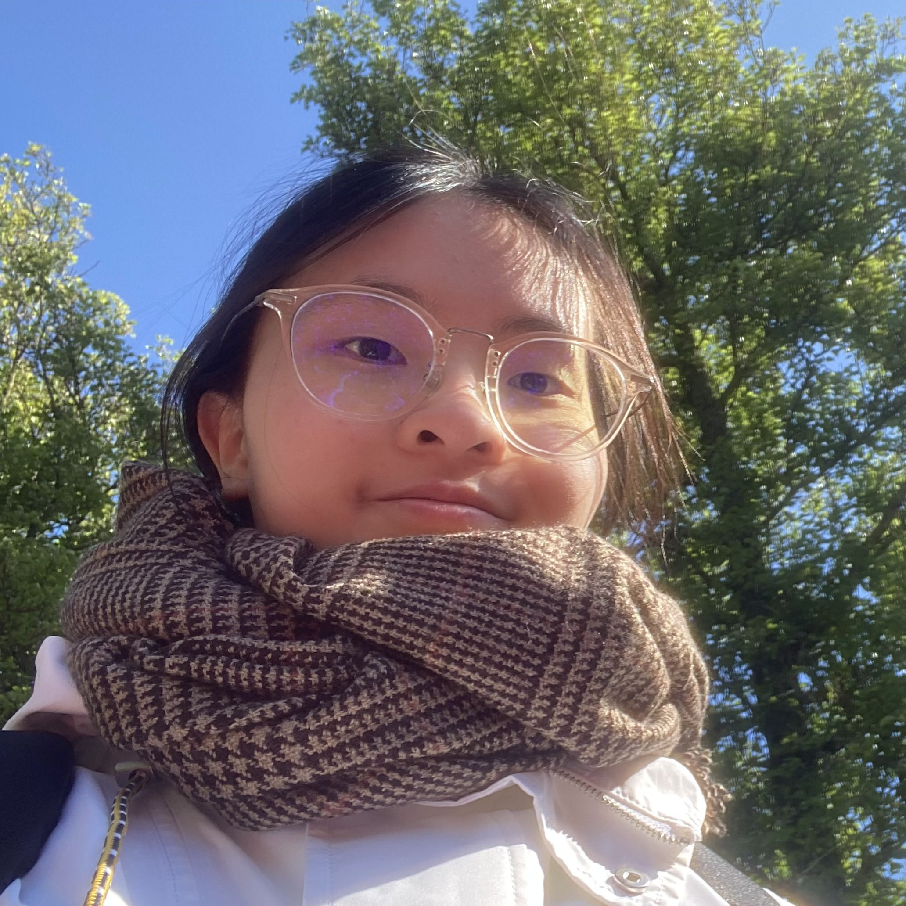

## About Me

Hello! I am a third year CS undergrad at the University of Toronto. I also pursue a physics major and a mathematics minor. Feel free to contact me if you want to collaborate!

## Research Interests

My research interests generally lie in healthcare/biotech $$\times$$ {graphics, vision, machine learning}. Previously, I worked on skin flap surgery simulations at [MEDCVR](https://medcvr.utm.utoronto.ca/). I am currently working on an exciting project on diverse human preferences in reinforcement learning from human feedback (RLHF) at [Vector Institute](https://vectorinstitute.ai/). I am also part of the [Wearipedia](https://www.wearipedia.com/) team for wearables from Snyder Lab based in Stanford.

---

## Projects
#### 1. Analyzing the effect of undermining on suture forces during simulated skin flap surgeries with a three-dimensional finite element method \[[code](https://mcsgitlab.utm.utoronto.ca/medcvr/medcvr-patch-3d/-/tree/allison)\]\[[preprint](https://a-llison-lau.github.io/VCBM_2024.pdf)\]

*Wenzhangzhi Guo, **Allison Tsz Kwan Lau**, Joel C. Davies, Vito Forte, Eitan Grinspun, Lueder Alexander Kahrs*

*Full paper @ EG VCBM 2024 (Eurographics Workshop on Visual Computing for Biology and Medicine)*

<!-- \[[course report](https://a-llison-lau.github.io/csc494-report.pdf)\] *(CSC494)* -->
We explored the suturing of a rhomboid cut on 3D rhomboid skin flap meshes and the optimal undermining regions using finite element method simulation and provided recommendations on the most optimal undermining region for rhomboid flaps.

#### 2. Wearipedia: A Python library for extracting data from wearable devices \[[code](https://github.com/Stanford-Health/wearipedia)\]\[[website](https://www.wearipedia.com/)\]\[[slides](https://docs.google.com/presentation/d/1oXU8OOlWbymEXDmUWjQkwmWW3c9kI7dtPcNK-kDt0_4/edit?usp=sharing)\]
We create a common interface to extract wearable data to simplify data extraction for clinical researchers.

#### 3. ADAM-Add: Enhancing ADAM with Adaptive Decay Rates \[[code](https://github.com/a-llison-lau/CSC413-Project)\]\[[report](https://a-llison-lau.github.io/csc413-report.pdf)\] *(CSC413/2516)*
We added an adative term for the decay rates in Adam and tested the performance of a modified Adam's optimizer on artificial landscape and several experiments following Adam's paper.

---

When I am not sitting in front of the computer, I enjoy the outdoors, or reading, or watching Netflix/YouTube. I'm passionate about learning. I love marine animals, especially marine mammals and octopuses. I have worked on various tasks, from 3D modeling to machining to video editing. One thing I've come to realize is that learning is never wasted!

#### See some related people ...
[Henry Yip](https://henry-yip.github.io/), [Toby Lam](https://users.ox.ac.uk/~ball5935/)

