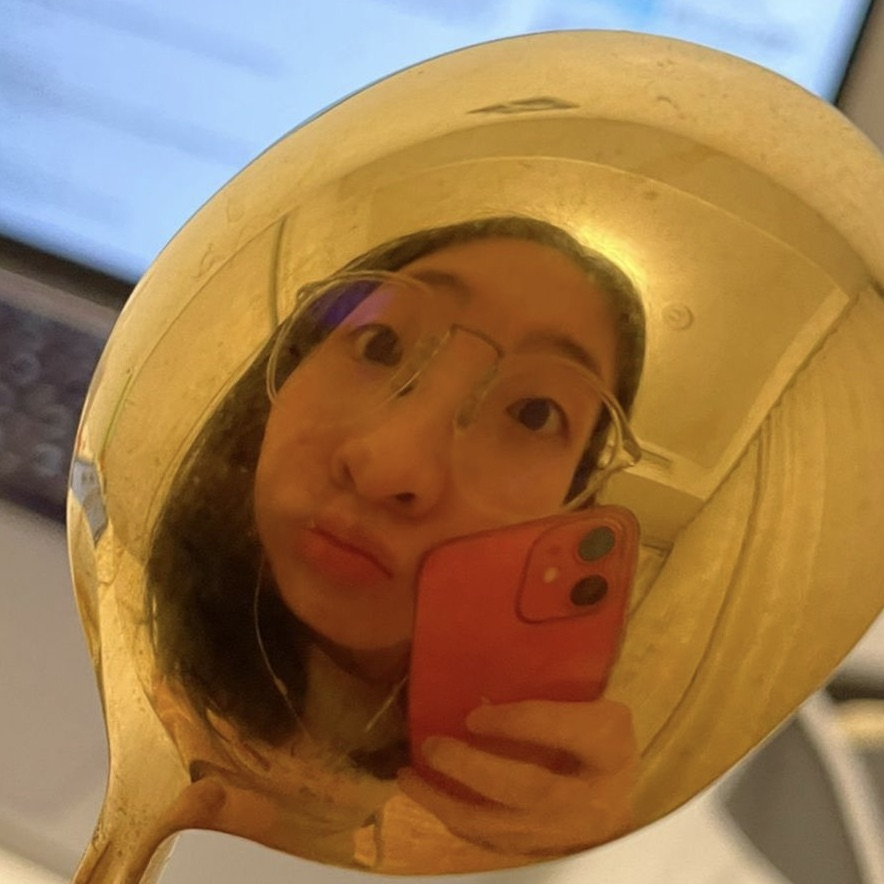

## About Me

Hello! I am a third year CS undergrad at the University of Toronto. Besides CS, I am also doing a physics major and mathematics minor. Feel free to contact me if you want to collaborate!

## Research Interest

My research interests generally lie in healthcare/biotech x {graphics, vision, machine learning in general}. But I am also broadly interested in graphics and theoretical computer science (although I am not so good at theories ...). I am currently working on some projects at [MEDCVR](https://medcvr.utm.utoronto.ca/) and also remotely on [Wearipedia](https://www.wearipedia.com/) based in Stanford.

When I am not sitting in front of the computer, I enjoy the outdoors, or reading or watching Netflix.

#### See some related people ...
[Henry Yip](https://henry-yip.github.io/), [Toby Lam](https://users.ox.ac.uk/~ball5935/)

